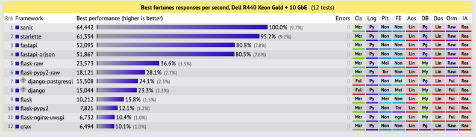
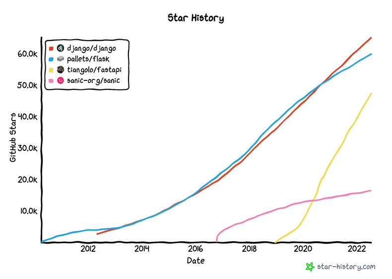
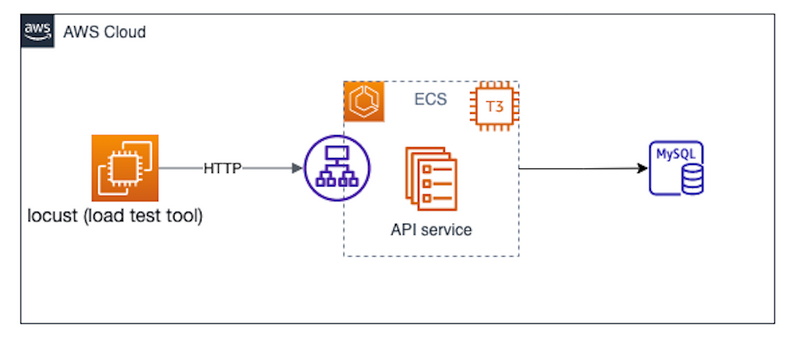
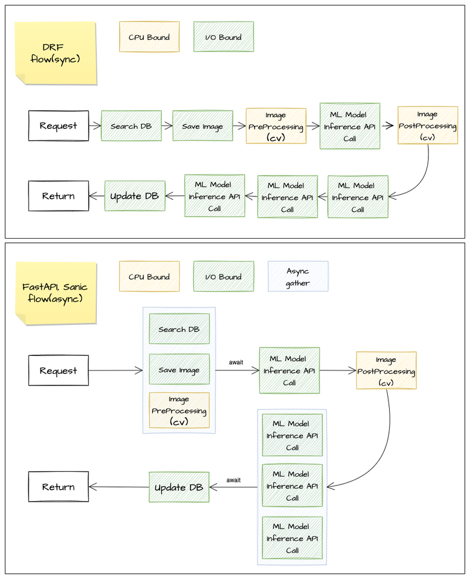

# 이미지 처리를 위한 파이썬 서버 프레임워크 선정기 with Django, FastAPI, Sanic
[출처: [이미지 처리를 위한 파이썬 서버 프레임워크 선정기 with Django, FastAPI, Sanic](https://tech.kakaopay.com/post/image-processing-server-framework/)]

- [1. Introduction](#1-introduction)
- [2. 문제 정의](#2-문제-정의)
- [3. 리서치](#3-리서치)
- [4. 테스트](#4-테스트)
- [5. 테스트 결과](#5-테스트-결과)
- [6. 결론](#6-결론)

## 1. Introduction
```plain text
카카오페이에서는 얼굴을 탐지하고 검증하는 기술을 활용하고 있다.
기존에는 서버를 Kotlin + Spring Boot를 통해 개발했다.
그러나 이미지 처리 코드 포팅 및 결과값 정합성 등을 이유로 Python 기반 서버 프레임워크를 사용하는 것으로 결정했다.
```

## 2. 문제 정의
```plain text
그렇다면 왜 Python 기반 서버 프레임 워크를 쓸까?

------------ 카카오페이 데이터실의 개발 플로우 ------------
1. 모델 학습 및 검증 (By data scientist)
2. 이미지 처리 로직 Python으로 작성 (By data scientist)
3. Python으로 작성된 코드 kotlin으로 포팅 (By ML engineer)
4. 결과 정합성 검증 (By data scientist & ML engineer)
5. 서버 개발 (By ML engineer)
6. 실제 서비스 적용
---------------------------------------------------

Kotlin + Spring Boot로 이미지 처리를 개발했기 때문에 3, 4번과 같이 포팅, 정합성 검증의 Flow가 필요했다.
원래는 Kotlin에서 OpenCV를 자바에서 사용하기 쉽게 래핑한 JavaCV가 있고, 행렬 처리는 native code로 구현했다.
하지만 Kotlin은 이미지 처리 작업이 메인이 아니었기 때문에 정보도 적고, 지원하지 않는 기능은 native code로도 문제가 있었다.
이러한 일련의 프로세스가 엔지니어에게 부담이었기 때문에 이를 없애고자 Python 기반 서버 프레임워크 사용하기 위해 테스트 진행했다.

----------------- 변경된 개발 플로우 ------------------
1. 모델 학습 및 검증 (By data scientist)
2. 이미지 처리 로직 Python으로 작성 (By data scientist)
3. 이미지 처리 로직 적용 & 서버 개발 (By ML engineer)
4. 실제 서비스 적용
---------------------------------------------------
```

## 3. 리서치

### (1) 주요 팩터
```plain text
- 실제 운영 환경에서 사용할 수 있는 안정성
- 기존 서비스보다 뛰어난 성능
- 개발할 때 서로 이해하기 쉽고 작성하기 쉬운 생산성
- 널리 사용되며 다양한 정보를 접하기 쉬운 생태계
```

### (2) 성능

```plain text
- Sanic, FastAPI: 비동기 방식
- Django, Flask: 동기 방식

비동기 방식인 Sanic과 FastAPI가 성능이 가장 빨랐고, 동기인 Django와 Flask가 그 뒤를 이었다.
```

### (3) 생태계


### (4) 결론
```plain text
- Django: 이미 많은 기업에서 사용해 안정성이 보장되어 있으며 뛰어난 문서와 큰 생태계를 가지고 있는 동기 API 서버
- FastAPI: 요즘 가장 빠른 상승세를 타고 있으며 빠른 성능과 높은 생산성을, 뛰어난 문서와 큰 생태계를 가지고 있는 비동기 API 서버
- Sanic: 간단하고 가벼운 API로 개발이 가능하고 가장 빠른 성능과 높은 생산성을 가지고 있는 비동기 API 서버
```

## 4. 테스트

### (1) 테스트 환경: [Locust](https://locust.io/)

```plain text
AWS EC2(m5.2xlarge) 환경에서 테스트를 진행했고, Locust를 이용해서 테스트 성능 측정을 했다.

Locust: 테스트 성능 측정에 사용될 클라이언트
```

### (2) 용어 정의
```plain text
- User: Locust에서 사용되는 용어로, 요청을 보내는 유저로 생각하면 되고, 유저의 수만큼 클라이언트에서 서버로 동시에 요청을 보내게 된다.
- Throughput (RPS: Request Per Second): 초당 서버에서 평균적으로 처리한 요청 수를 의미한다.
- Latency: 클라이언트에서 보낸 요청이 처리되어 응답받는 데까지 걸린 평균 시간을 의미한다. 단위는 ms
```

## 5. 테스트 결과

```plain text
위 그림은 `sync`와 `async`의 차이에 의한 테스트 Flow의 차이를 시각화한 것이다.
```

### (1) Load Test
정해진 환경에서 약 30분 동안 진행했고, 임계점 판단을 위해 4단계로 나눠 테스트
```plain text
1. Instance(CPU 2 Core, mem 1GiB) - 8, User - 256  : 별 차이 없다.
2. Instance(CPU 2 Core, mem 1GiB) - 8, User - 512  : DRF의 RPS가 130정도, FastAPI와 Sanic의 RPS는 약 160정도
3. Instance(CPU 8 Core, mem 1GiB) - 8, User - 512  : CPU 코어 수 늘리니 RPS도 모두 증가
4. Instance(CPU 8 Core, mem 1GiB) - 8, User - 1024 : RPS가 DRF < FastAPI < Sanic

이미지가 Request에 담기는 서비스 특성상 대용량 Request를 처리해야 한다.
따라서 인스턴스 설정(CPU Core)이 RPS 성능에 큰 영향을 준 것이라고 판단됐다.
```

### (2) Endurance Test
정해진 환경에서 약 24시간 동안 진행했고, 운영 환경에서도 장시간 이슈없이 서비스가 제공되는지 테스트
```plain text
세 프레임워크 모두 서비스가 이슈없이 유지된다.
```

## 6. 결론
Django, FastAPI, Sanic 모두 실제 운영 환경에 올라가도 될만큼 성능이 준수하며 안정적이다.

### (1) 생산성/생태계 테스트 - API 문서 자동화
|         | 자동화 가능 문서 | Request scheme                                                 | Response scheme                                                | 비고                                            |
|---------|------------------|----------------------------------------------------------------|----------------------------------------------------------------|-------------------------------------------------|
| DRF     | Swagger, ReDoc   | drf serializer로 작성 / 추가 코드 작업 시 문서에서 스키마 제공 | drf serializer로 작성 / 추가 코드 작업 시 문서에서 스키마 제공 | 규격에 맞게 추가 코드 작업 필요 (drf-yasg 사용) |
| FastAPI | Swagger, ReDoc   | pydantic BaseModel로 작성 시 문서에서 스키마 제공              | pydantic BaseModel로 작성 시 문서에서 스키마 제공              | 추가 코드 작업 없이 간편하게 문서 자동화        |
| Sanic   | Swagger, ReDoc   | pydantic BaseModel로 작성 시 문서에서 스키마 제공              | pydantic BaseModel로 작성 시 문서에서 스키마 제공              | 추가 코드 작업 없이 간편하게 문서 자동화        |

**다들 Good!**

### (2) Serializer validation
```plain text
기존에는 서버 통신 간 암호화된 이미지 및 각종 정보들을 JSON String 형태로 request body에 담아 Object로 역직렬화해서 처리함
DRF에서는 drf serializer, FastAPI/Sanic에서는 pydantic이 이를 담당한다.

drf serializer, pydantic 두 프레임워크 모두 유의미한 기능 차이는 없었다.
- drf serializer는 객체마다 Serializer를 작성해주어야 한다.
- pydantic은 BaseModel을 상속받기만 해도 된다.

따라서, 개발 생산성은 pydantic이 더 좋았습니다.

속도를 비교해봤더니, 100만 건 기준으로 Pydantic이 drf serializer보다 역직렬화 속도가 약 26배 빨랐다.
속도는 pydantic이 압도적으로 빨랐지만, 실제 요청의 latency에 유의미한 영향을 줄만큼 비중이 크지는 않았다.
```

### (3) 찐 결론
- FastAPI, Sanic이 성능은 물론이고, 안정성도 뛰어나다.
- 카카오페이에서는 `FastAPI`로 결정했다.